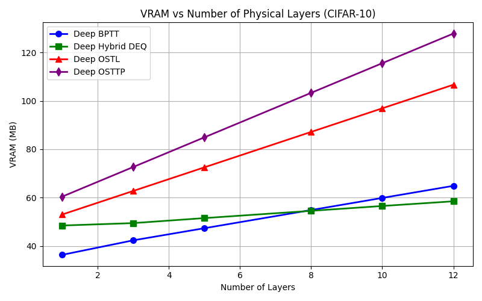
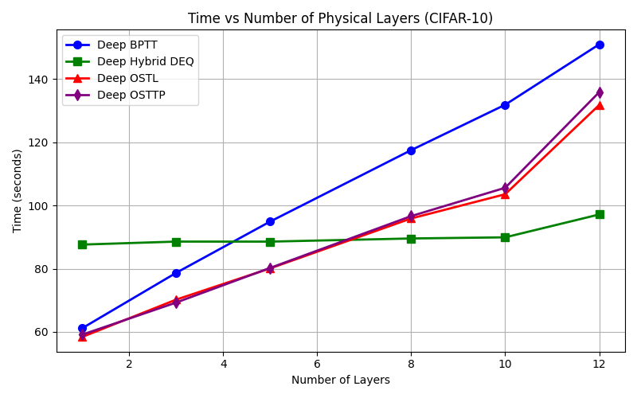
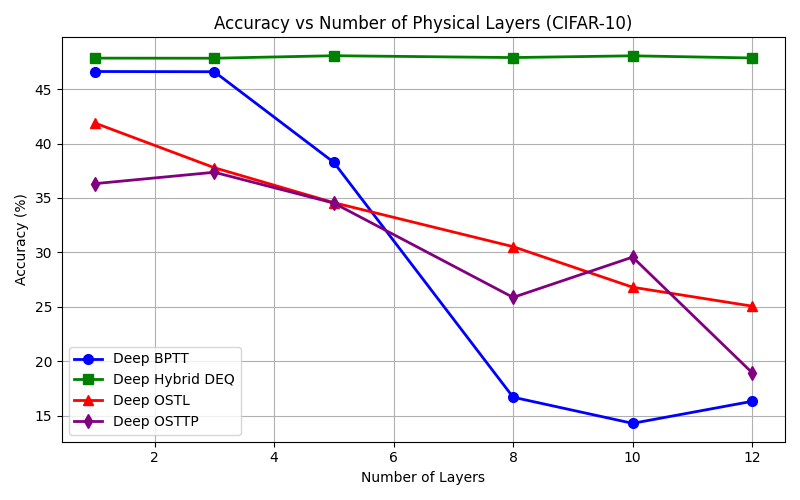

# YURIformer :3

heya everyone :] welcome to YURIformer! this entire architecture is aggressively vibe coded, meaning I used AI to help me mostly with the code to prototype faster [and i cant code] but all the things like triton kernels and DEQ solver algorithims are verified by me :3

tho it was designed to be a modular library for efficiency and innovative learning rules, neural nets, and efficient numerical operations :] 

---

### [Written by a human] (Q&A Time! :3)
**What is the purpose of the project?**

The purpose of this project was to simplify the implementation of innoative learning rules and architectures :]
currently I have implemented DEQ kernels for learning and posit 16 kernels for our DEQs and numeric operations :3 

**What is under development?**

- I will explore neuromorphic computing next like adding OSTL , OSTTP, OTTT, and much more ya can use :3
- I will also explore niche parts of ML beyond just these 2
- While i did mention i will add neural networks they are sadly under progress :[

**How/What to contribute?**
 - while this project IS vibecoded [tho i am learnibng to write code by hand!] I encourage people to contribute using their own sweats and tears [aka written by real human :) ]
 - I also encourage opening issues for bugs or errors that i could try to fix well 
 - I also heavily encourage you to make PRs since we need more human written code more human creativity :]

---

### [Generated by an AI]

**Installation**

Since the project is structured properly with a `pyproject.toml`, you can easily install it locally. Just clone the repo and install it in editable mode :3

```bash
git clone https://github.com/moelanoby/YURIformer.git
cd YURIformer
pip install -e .
```
or

```bash
pip install yuriformer
```

This will automatically install dependencies like `torch`, `triton`, and `numpy`.
Once installed, you can import the top-level packages directly into your projects, no matter where your script is located:

```python
import learning_rules
import architecture_kernels
import numeric_kernels
```

---

**How to Use DEQ Kernels (Drop-in Replacement for Infinite Depth)**

We have a fully modular Deep Equilibrium (DEQ) library that replaces Backpropagation Through Time (BPTT) for implicit *depth* (weight-tied layers), rather than sequence time. It effectively gives you an infinite-depth network with O(1) memory and super fast training! :]

```python
import torch
import torch.nn as nn
from learning_rules.DEQ_kernels import DEQModule, HybridConfig, SolverFactory

# 1. Define your recurrent cell (the exact same one you use for BPTT!)
class MyCell(nn.Module):
    def __init__(self, dim):
        super().__init__()
        self.fc = nn.Linear(dim, dim)
        self.norm = nn.LayerNorm(dim)
        
    def forward(self, z, x):
        return torch.tanh(self.norm(self.fc(z) + x))

# 2. Pick a solver config (e.g., Hybrid, Anderson, Broyden, or PJWR) :p
cfg = HybridConfig(max_iter=40, tol=1e-4)

# 3. Wrap your cell in the DEQModule :3
cell = MyCell(dim=64)
solver = SolverFactory.create(cfg, cell)
deq_layer = DEQModule(cell, solver=solver, backward_mode='phantom')

# 4. Forward pass finds the fixed point implicitly! :D
x = torch.randn(32, 64)
z_star = deq_layer(x)
```

Or import everything from the top-level package :3

```python
from learning_rules import DEQModule, HybridConfig, SolverFactory
```

**Wanna see it in action? Check out the drop-in replacement example!** :D

We wrote a super detailed script that shows you *exactly* how to transition your codebase from BPTT to DEQ! Go open up `examples/deq_dropin_replace_bptt.py` and give it a read :3

---

**How to Use OSTL (Online Spatio-Temporal Learning)**

OSTL replaces BPTT with **eligibility traces** — a biologically-inspired, online three-factor learning rule that never unrolls the sequence and uses **O(1) memory** regardless of how deep the recurrence goes :3

The key idea: instead of storing every hidden state to backprop through, we keep a running *trace* that accumulates the temporal contribution of each weight, then multiply it by the error signal when it arrives.

```python
import torch
import torch.nn as nn
import torch.optim as optim
from learning_rules.neuromorphic_kernels import OSTL_Function, manual_train_step_ostl

# ── 1. Define a simple recurrent cell ────────────────────────────────────────
class RecurrentCell(nn.Module):
    def __init__(self, dim):
        super().__init__()
        self.Wz = nn.Linear(dim, dim)   # recurrent weight
        self.Wx = nn.Linear(dim, dim, bias=False)  # input weight
    def forward(self, h, x):
        return torch.tanh(self.Wz(h) + self.Wx(x))

# ── 2. Build a deep OSTL model ───────────────────────────────────────────────
class DeepOSTLModel(nn.Module):
    def __init__(self, num_layers, in_dim, hidden_dim, out_dim, n_steps=8, decay=0.9):
        super().__init__()
        self.proj_in = nn.Linear(in_dim, hidden_dim)
        self.cells   = nn.ModuleList([RecurrentCell(hidden_dim) for _ in range(num_layers)])
        self.head    = nn.Linear(hidden_dim, out_dim)
        self.n_steps = n_steps
        self.decay   = decay

    def forward(self, x):
        # Standard forward (used for inference / accuracy eval)
        z = self.proj_in(x.view(x.size(0), -1))
        for cell in self.cells:
            h = torch.zeros_like(z)
            for _ in range(self.n_steps):
                h = cell(h, z)
            z = h
        return self.head(z)

    def local_forward(self, x):
        """Returns (logits, traces, x_flat, z_final) for the manual training step."""
        x_flat = x.view(x.size(0), -1)
        z = self.proj_in(x_flat)
        traces = []
        for cell in self.cells:
            h, h_trace = torch.zeros_like(z), torch.zeros_like(z)
            for _ in range(self.n_steps):
                h       = cell(h, z)
                h_trace = self.decay * h_trace + h
            sum_decay = (1 - self.decay**self.n_steps) / (1 - self.decay)
            traces.append((z * sum_decay, h_trace, cell))
            z = h
        return self.head(z), traces, x_flat, z

# ── 3. Train with manual_train_step_ostl (no loss.backward() on the cells!) ──
model     = DeepOSTLModel(num_layers=5, in_dim=784, hidden_dim=128, out_dim=10)
optimizer = optim.Adam(model.parameters(), lr=1e-3)

x = torch.randn(32, 784)          # a batch
y = torch.randint(0, 10, (32,))

loss = manual_train_step_ostl(model, x, y, optimizer)
print(f"Loss: {loss:.4f}")        # weights updated — no BPTT!
```

**Key properties of OSTL:**
- 🧠 **No BPTT** — recurrence runs under `torch.no_grad()`; no unrolled graph stored
- ⚡ **O(1) memory** w.r.t. number of recurrent steps
- 📡 **Error Broadcast** — the global loss error is passed unchanged to every layer (Bypass / DFA-style)
- 🔧 Works with any cell that exposes `cell.Wx` and `cell.Wz` linear layers

---

**How to Use OSTTP (OSTL + Direct Random Target Projection)**

OSTTP goes one step further than OSTL: it also removes **spatial** backpropagation between layers. Each layer's weight update uses a fixed random matrix to project the global error *locally*, eliminating the weight-transport problem entirely :3

```python
import torch
import torch.nn as nn
import torch.optim as optim
from learning_rules.neuromorphic_kernels import manual_train_step_osttp

# ── Model is identical to OSTL but also stores random projection matrices ────
class DeepOSSTTPModel(nn.Module):
    def __init__(self, num_layers, in_dim, hidden_dim, out_dim, n_steps=8, decay=0.9):
        super().__init__()
        self.proj_in          = nn.Linear(in_dim, hidden_dim)
        self.cells            = nn.ModuleList([RecurrentCell(hidden_dim) for _ in range(num_layers)])
        # Fixed random matrices — one per layer, shape (hidden_dim, hidden_dim)
        self.random_projections = nn.ParameterList([
            nn.Parameter(torch.randn(hidden_dim, hidden_dim), requires_grad=False)
            for _ in range(num_layers)
        ])
        self.head    = nn.Linear(hidden_dim, out_dim)
        self.n_steps = n_steps
        self.decay   = decay

    def forward(self, x):
        z = self.proj_in(x.view(x.size(0), -1))
        for cell in self.cells:
            h = torch.zeros_like(z)
            for _ in range(self.n_steps):
                h = cell(h, z)
            z = h
        return self.head(z)

    def local_forward(self, x):
        x_flat = x.view(x.size(0), -1)
        z = self.proj_in(x_flat)
        traces = []
        for i, cell in enumerate(self.cells):
            h, h_trace = torch.zeros_like(z), torch.zeros_like(z)
            for _ in range(self.n_steps):
                h       = cell(h, z)
                h_trace = self.decay * h_trace + h
            sum_decay = (1 - self.decay**self.n_steps) / (1 - self.decay)
            traces.append((z * sum_decay, h_trace, cell, self.random_projections[i]))
            z = h
        return self.head(z), traces, x_flat, z

# ── Train — each layer gets a locally projected error, not weight.T @ error ──
model     = DeepOSSTTPModel(num_layers=5, in_dim=784, hidden_dim=128, out_dim=10)
optimizer = optim.Adam(model.parameters(), lr=1e-3)

loss = manual_train_step_osttp(model, x, y, optimizer)
print(f"Loss: {loss:.4f}")
```

**Key properties of OSTTP over OSTL:**
- 🔒 **No weight transport** — `projected_error = error @ B` (random matrix), not `error @ W.T`
- 🏝️ **Fully local** — every layer only needs its own traces + a fixed random matrix
- 🤖 Great for neuromorphic hardware where global communication is expensive

---

**Benchmarks**

Run the full CIFAR-10 layer-scaling benchmark yourself :3

```bash
cd YURIformer
python examples/run_depth_benchmarks.py
```

Plots are saved to `benchmark_plots/` after the run.





*CIFAR-10 · Layer Scaling · `hidden_dim=256` · 5 epochs per configuration*

| Method | Spatial BP? | Temporal BP? | Memory Scaling |
| :--- | :---: | :---: | :--- |
| **Deep BPTT** | ✅ | ✅ | O(L × T) |
| **Deep Hybrid DEQ** | ✅ | ❌ (phantom) | O(1) implicit depth |
| **Deep OSTL** | ✅ (bypass) | ❌ (traces) | O(L) |
| **Deep OSTTP** | ❌ (projection) | ❌ (traces) | O(L) |

**DEQ Solver Benchmarks** *(synthetic task, 30 training steps)*

| Training Method | Memory Scaling | Speed (30 steps) | Accuracy | Where they break (usually) |
| :--- | :--- | :--- | :--- | :------------ |
| **Standard BPTT** (unroll=5) | O(N) | 0.12s | 100% | its O(L) memory cost |
| **Standard BPTT** (unroll=20) | O(N) | 0.11s | 92% | its O(L) memory cost |
| **DEQ (PJWR)** | O(N) | **0.03s** | 55% | it is fast! but falls short in accuracy if not intialized correctly |
| **DEQ (Broyden)** | O(N) | 0.19s | 55% | without anderson warm up it also falls short in accuracy |
| **DEQ (Hybrid)** | O(1) | 0.27s | **100%** | yes it is fast but might fall short in other benchmarks that this doesnt show but not as much as the previous 2 |
| **DEQ (Anderson)** | O(N) | 0.29s | **100%** | THE INDUSTRY STANDARD but CAN be a bit slower than the hybrid in long runs |

*Note: The solvers find the fixed point z\* implicitly, bypassing the need to store activations for the entire depth history! :]*
